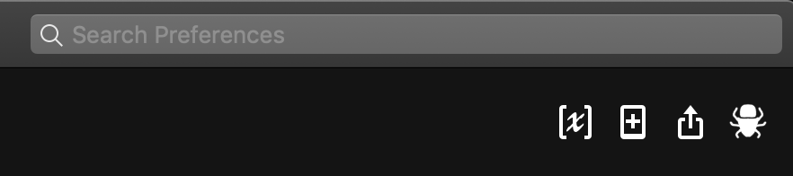
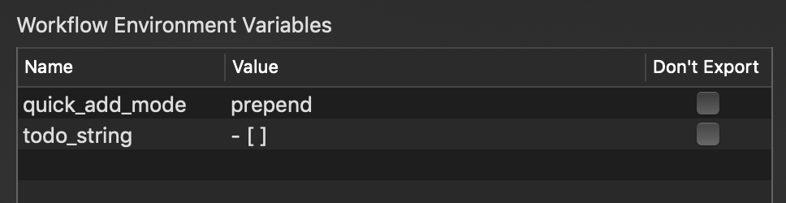

# Alfred Noteplan Actions

Alfred workflow for handy Noteplan actions.

**[Downloads](https://github.com/beet/alfred_noteplan_actions/releases)**

I'm migrating across to Noteplan from Wunderlist which has an awesome ubiquitous quick add and search feature that I can't live without, so these actions are mainly to provide similar functionality for Noteplan through Alfred.

I'd also have preferred Noteplan to have provided native auto-completion of wiki links, but it does provide a means of copying a page's link.

The create link note action is just something I use personally.

## Settings

To customise the workflow settings to your own preferences, select the workflow in Alfred and click the weird icon in the top right that looks kinda like `[X]`:



You can then change the values of workflow environment variables:




## Open note

Keyword: `t`

Fuzzy search of text notes by heading.


## Quick add

Keyword: `q`

Create a task in today's calendar note from the entered text.

### Settings

`todo_string`: You can change the todo string from `- [ ]` to any other character that NotePlan recognises like * or -.

`quick_add_mode`: You can also change the insertion mode from the default of prepend which inserts the todo at the top of the calendar, to append which adds it to the bottom.

## Insert wiki link

Keyword: `wl`

Insert a wiki link to any text note with fuzzy search of the page headings, which is how NotePlan interlinks pages internally.

## Create link note from URL

Keyword: `link`

Past in a URL, like `https://noteplan.co`, and this workdlow action will create a new note like:

```markdown
# Link - NotePlan - Organize Everything Bullet Journal Style

[NotePlan - Organize Everything Bullet Journal Style](https://noteplan.co)

#links
```

I usually add a short note beneath the link, and add some relevant tags to make the note easier to retrieve later.

## Insert hashtag

Keywork: `hashtag`

Autocomplete of hashtags would be super useful, but seeing as it's missing, you can quickly insert any of your existing hashtags using fuzzy search of all hashtags used in all text notes with this handy workflow.

Currently only allows one hashtag to be inserted at a time.

_(Actually just inserts it into whatever program you happen to be using via the clipboard)_
