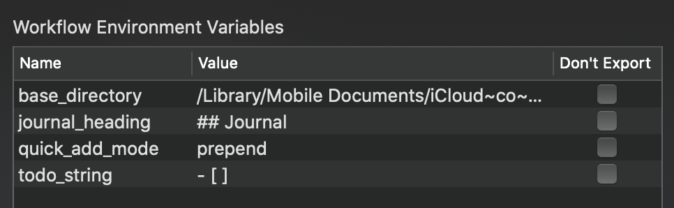

# Alfred Noteplan Actions

Alfred workflow for handy Noteplan actions.

**[Downloads](https://github.com/beet/alfred_noteplan_actions/releases)**

[Bullet Journalling](https://bulletjournal.com) is described as "a mindfulness practice disguised as a productivity system", and while pen and paper may suit many, for me [NotePlan](https://noteplan.co) is the perfect intersection of digital convenience and Bullet Journal mindfulness.

By providing an [extensive x-callback-url scheme](https://noteplan.co/faq/General/X-Callback-Url%20Scheme/), NotePlan has allowed this [Alfred](https://www.alfredapp.com) workflow to extend its functionality to get even more done with less effort.

## Settings

To customise the workflow settings to your own preferences, select the workflow in Alfred and click the weird icon in the top right that looks kinda like `[X]`:


You can then change the values of workflow environment variables:



### Changing the notes location from iCloud to Dropbox etc.

If you're not using iCloud for syncing your notes, you can change the `base_directory` environment variable to the **relative path** of wherever your notes are stored.

For example, if your notes are under `/Users/foo/Dropbox`, change `base_directory` to `/Dropbox`, or wherever they happen to be under your home holder.

## Open note

Keyword: `t`

Fuzzy search of text notes by heading.


## Quick add

Keyword: `q`

Create a task in today's calendar note from the entered text.

### Settings

`todo_string`: You can change the todo string from `- [ ]` to any other character that NotePlan recognises like * or -.

`quick_add_mode`: You can also change the insertion mode from the default of prepend which inserts the todo at the top of the calendar, to append which adds it to the bottom.

## Insert wiki link

Keyword: `wl`

Insert a wiki link to any text note with fuzzy search of the page headings, which is how NotePlan interlinks pages internally.

## Create link note from URL

Keyword: `link`

Past in a URL, like `https://noteplan.co`, and this workdlow action will create a new note like:

```markdown
# Link - NotePlan - Organize Everything Bullet Journal Style

[NotePlan - Organize Everything Bullet Journal Style](https://noteplan.co)

#links
```

I usually add a short note beneath the link, and add some relevant tags to make the note easier to retrieve later.

## Insert hashtag

Keyword: `hashtag`

Autocomplete of hashtags would be super useful, but seeing as it's missing, you can quickly insert any of your existing hashtags using fuzzy search of all hashtags used in all text notes with this handy workflow.

Currently only allows one hashtag to be inserted at a time.

_(Actually just inserts it into whatever program you happen to be using via the clipboard)_

## Journal summary

One of the most powerful aspects of Bullet Journalling is the [reflection process](https://bulletjournal.com/blogs/bulletjournalist/reflection). While there have been some [hints](https://twitter.com/NotePlanApp/status/1151547198854914050) at NotePlan providing some kind of separation of daily notes, I've taken to the following convention:

* End each day with a quiet reflection
    * _(Use one of NotePlan's beautiful dark-themes for kindness to your circadian rythm)_
* Add a sub-heading to the bottom of the day's calendar note like `## Journal`
* Follow that with a short journal entry

The tactile feel of flipping back through calendar notes to review your recent journal entries is quite similar to paging through a paper notebook. Could it trigger similar neural pathways?

This is fine for week to week reflection, but for a birds-eye view from month to month, or even an entire year _(I've been doing this since Jan 2019)_, open Alfred and enter the keyword `js` to have it extract all of your journal entries, sort them chronologically, and create a summary in a new text note.

Keyword: `js`

### Settings

`journal_heading` - defaults to `## Journal`, but you may wish to use a different heading level or title.

This will be used for the title of the summary text note. For example, the default calendar note heading of `## Journal` will produce a text note with a title of `# Journal Summary`
